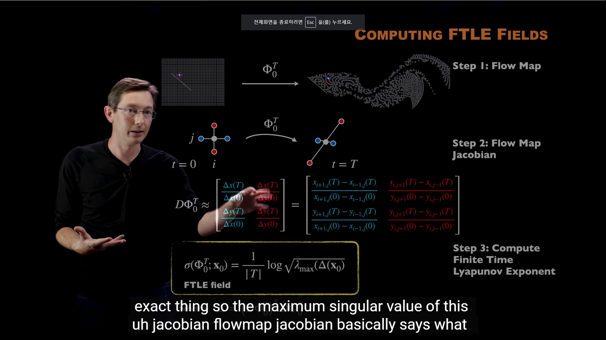
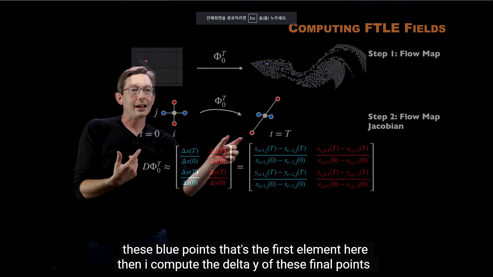
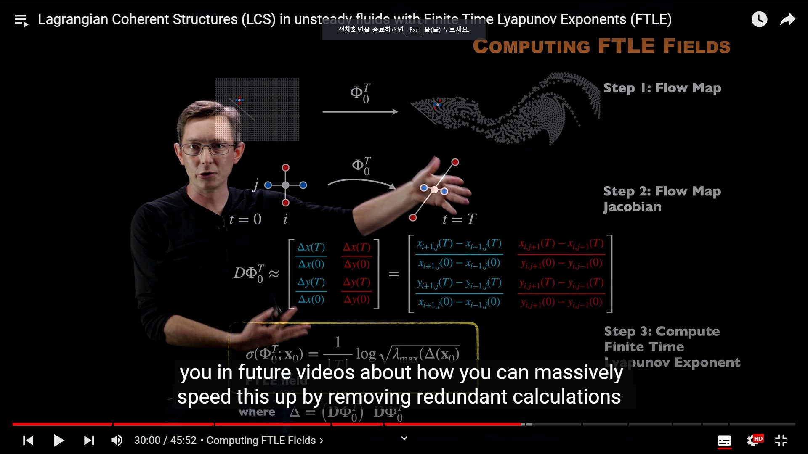

# LCS and Unsteady Fluid Dynamics

Finite Time Lyapunov Exponent(FTLE)

Coherent Sturcture

classical visualise 

paritcle 추적 시스템 byoyant 힘에 따라서 흘러갈때. 

Flowmap equation
$$
x(t)= x_0 + \int_0^T (u(x(\tau),\tau))d\tau = \phi _0^T (x_0) =flow map
$$

x를 따라서 가서 적분 했을 때 위와 같이 표현을 해줄 수 있다. RK integrator

고유값을 기준으로 2가지 subspace가 구분이 된다.

?? Unstable manifold 
?? Stable Manifold

positive ime LCS
negative time LCS

2002, Haller 논문 참고.

Lgrangian Coherent Structures. by Haller.

Computing FTLE FIELDS. 

1. Flow Map
2. Check Neighbor changed.
3. Deformation이 되지 않늗나면, 동일한 네이버후드를 유지함. 하지만, 깨지는 경우 바뀌는것임.

대략적으로 jaocibain을 가정함.

$$
D\phi_{0}^T
$$

고유 값의 최대 값은 최대로 strech할 수 있는 방향을 의미한다.

Backward와 Forward 방향을 생각해보자면, 백워드 방향으로 갈때 유체는 발산하는 것처럼 보일 수 있다. 이를 해석하기 위한 과정은 FTLE Filed가 있다.

Detection of Lagrangian coherent structures in three-dimensional turbulence.

Repelling CLS and Attracting LCS.

