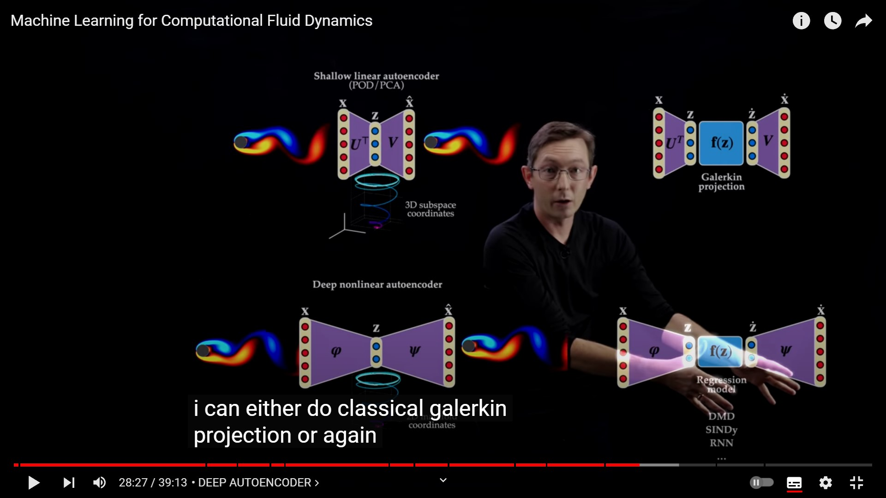

ML을 CFD에서 사용하는 것은 3가지 경우가 존재한다.

1. Accerlate Simulations, Improve Scaling
2. Improve Phsycal Understanding.

- DNS
  - Turbulent flow arround a wing .. good vidoe
  - fidelity ?
  - Learning Data driven discretization for partial differential equations.
  - Enhacnment of shock cpaturing shcemes via machine learning.
    - Shock Catpuring 비교 논문
    - improvment to classical method 
  - Finite Net :Convoultional LSTM for PDEs
    - good for time d
    - ti foind different csales.
    - this is formualated PDES.
## Impcompressibility & Possion equation.

계산 효율을 위해서 포아송 방정식을 풀어주는 것이 하나임. take adviective step. i have to kind of correct. often time correction term.

baiscaaly have to sovle this is a kind of and error term and liss term

lossterm...  Los function can be defiend as below

$$
L = || \hat{u}-u||^2 + \lambda || \nabla \cdot \hat{u} ||^2
$$

- Trubulence Modelng
  - Turbulecne Modeling in the age of data . -> introduce emerging technique.
- Reudced Order Models.
  - Fast Efficient 
  - Highly tailored and customized solutions
  - small subset of flow and configureation.
  - big opertunitiy here

Coordinate System -> Auto Ecnoder as shonw bleow

classical modeling theory is SVD, PCA and POD. few we know that we can compute SVD. and get tailor made orhtobnal modes as possible those coeffcient .. reduced vectoa a is minmaal.. 

$u(x,t)=\bar{u}+\sum_{k=1}{\phi_k(x)a_k(x)}$

What's nice is r-> data is pexlinaed if, i allow... nonlinear actiavation funciton.

orthogonal -> galernkin projection (can be reuduced)

svd -> canbe repalce in to auto encoder. CNN to extact feature

LEE 2020 (auto encoder)

CLUSTER Reduced Order Modeling (CROM)

relatively simple..  

SPARSE TRUBEULCNE MODELS

