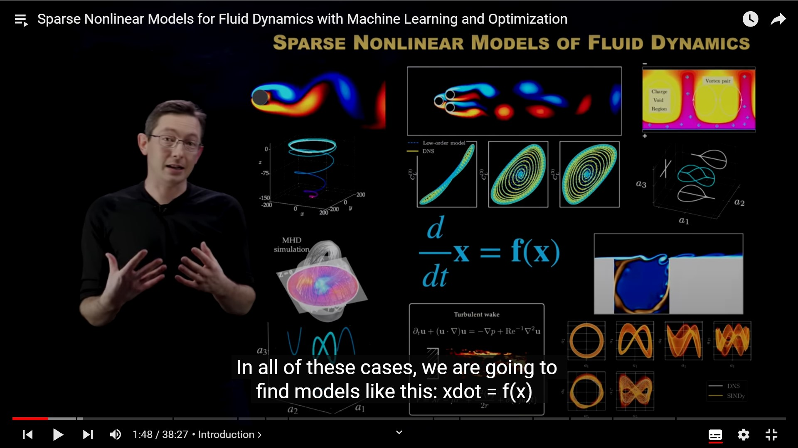
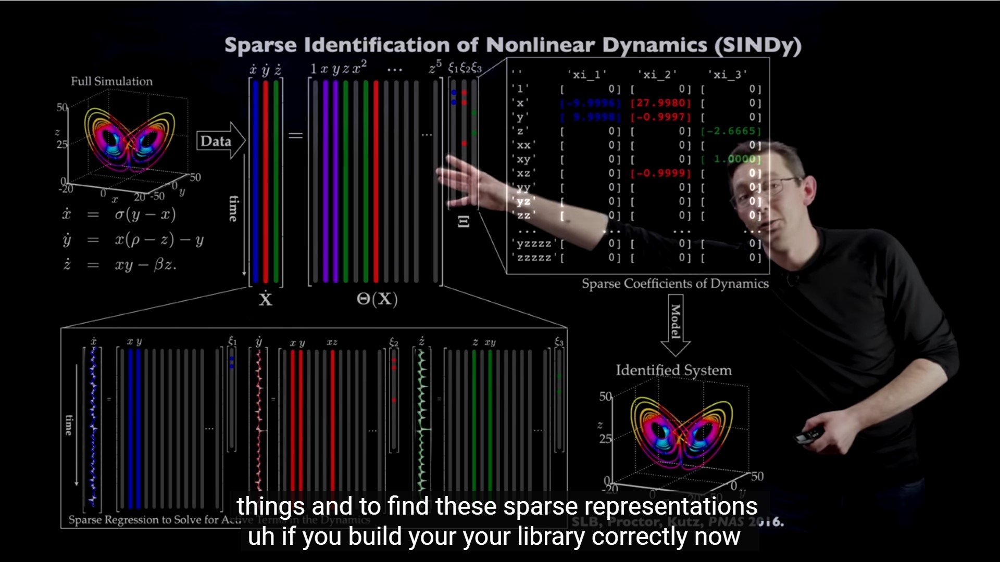
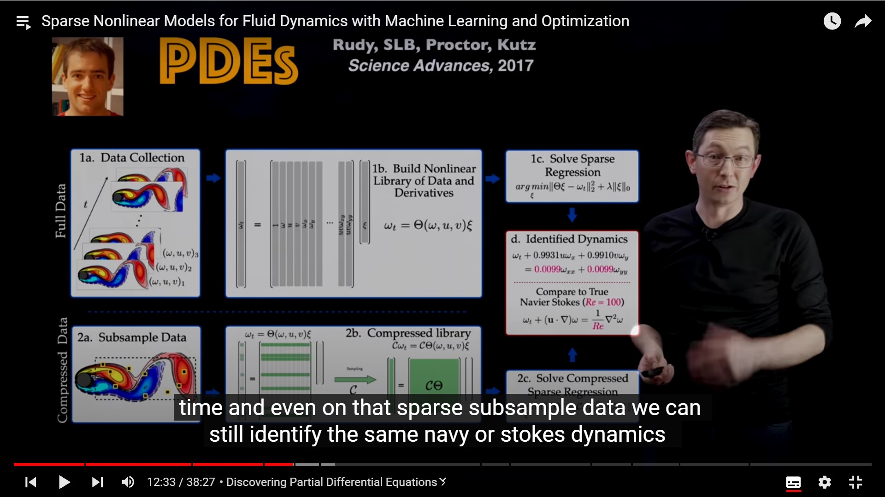
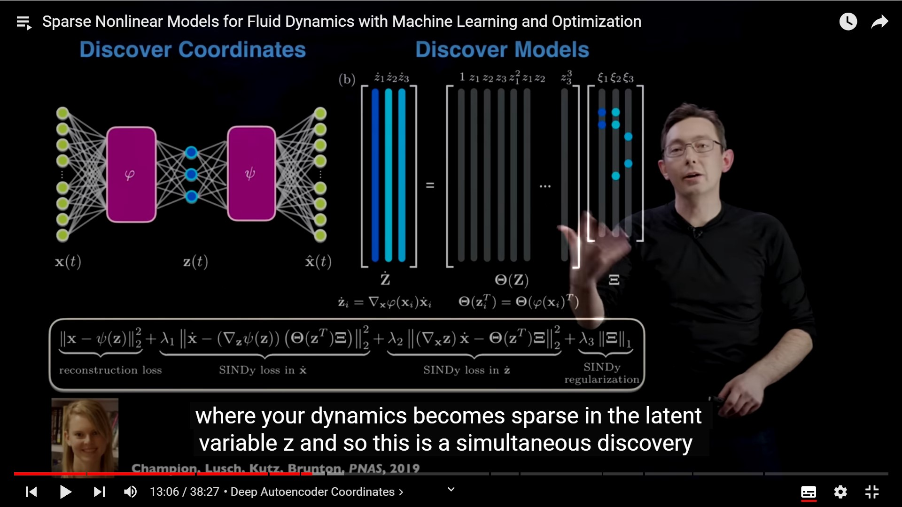
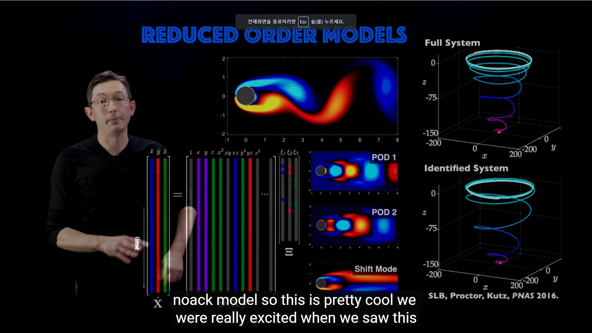

Sparse nonlinear Models of Fluid Dynamics

모든 식은 다음과 같이표현 됨.
$$
\frac{d}{dx}x = f(x)
$$

x is low dimensional vector , coherent patterns in theese flow. extact the most inpoent strucuture.

## Cathotic Thermal Convection

위에는 찬공기 아래는 뜨거운 공기 경계조건을 가지고 시뮬레이션을 하는 것.

이것 은 로렌츠 모델에 동기부여가 됐다. 

low diemosional in sense of lorenz is chariterized 3 dimensional problem.

## Sindy (Sparse Indentification of Nonlinear Dynamics) SINDy

 -> DMD (Dynamic model Decomposition)

    We Can use PySINDy

 

PDEs 

FullData (2017, Rudy) Run Navier stokes ..

mEasure random space and time 

아래그림 중요.
https://www.pnas.org/doi/abs/10.1073/pnas.1906995116

Auto ENCODER. Really Cool over.. (2019,Champion)
https://arxiv.org/abs/1611.03271

### Reduced Order Models.

[2003, Noak]
https://arxiv.org/abs/1706.03531

Links
https://www.pnas.org/doi/10.1073/pnas.1517384113

https://www.youtube.com/redirect?event=video_description&redir_token=QUFFLUhqbjZydWtOVE8zWHRxR2lkUDhBU2VWbXRKXzVQUXxBQ3Jtc0trWmgwV3c3MnRmdU1SVGd6VlFVLWRmWmllOHFwWGdCRlp6U2s5ZGV0eHIxZ0kyWHN2cTJIQ0xsNFIwY3VPYnJpdG9tanltbXJtOXN1S1lyaVdTZVpMWjNsUk9YbTFQbHNGek81dlJKZFZfMlE3WkVRUQ&q=https%3A%2F%2Fadvances.sciencemag.org%2Fcontent%2F3%2F4%2Fe1602614&v=z_CZ_VyMDXE

https://modred.readthedocs.io/en/stable/tutorial_modaldecomp.html