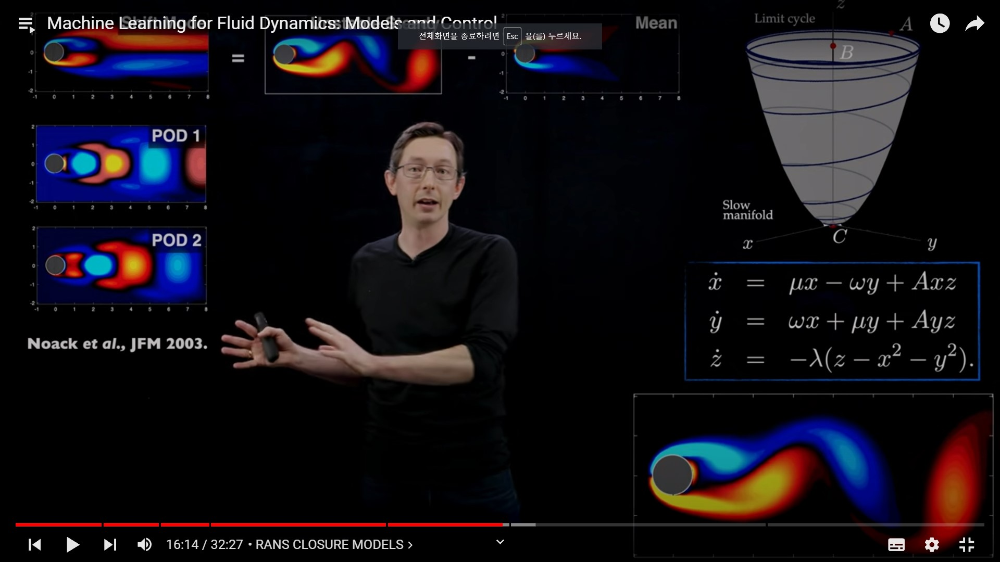

Machine Learning : Models form data via optimization.

|Optimization Problem | Fluid dynamics task |
|---|---|
|High Diemnsional | Reduction|
|Nonlinear | Modeling |
|Non Convex | Control | 
|Mutliscale | sensing and clousre |

[2020,steven] machine .. 

Pattern exist in data in fluid system. 

Modern machine learning gorwing in pattern. Rishiri Isanland 

Complexity 

$$
\begin{aligned}
    \frac{\partial{\bf{u}}}{\partial{t}}+ \bf{u} \cdot\nabla\bf{u} &= -\nabla p + \frac{1}{Re} \nabla^2 \bf{u} \\

\nabla \cdot \bf{u} &=0
\end{aligned}

$$

Complexity는 Re수에 따라서 달라지게 된다. 위식에 따라서 Re수가 커지면 커질 수록 점성항의 영향력이 적어지고, 난류항에 대한 영향력이 커진다. 아래 그림과 같이 Re가 커질 수록 Complexity는 더욱 커지는 것으로 볼 수 있다.

 이에 단순한 식의 풀이가 가능해지지만, Re가 작을 수록 점성항의 영향이 커진다.

 ## Kolmogorov Energy Cascade

 Big Energy Energy contian in big vorticity

 mathmatically 

first .. bigt constructure.. and big couples system. 소용돌이가생겨나고 이 부분들이 점차 작은 에너지에 전달되는 시스템 간단하게 풀이해보면
$$
\begin{aligned}
\dot{x_1} &=f_1(x_1,x_2,x_3,x_4,\cdots) \\
\dot{x_2} &=f_2(x_1,x_2,x_3,x_4,\cdots) \\
\dot{x_3} &=f_3(x_1,x_2,x_3,x_4,\cdots) \\
\dot{x_4} &=f_4(x_1,x_2,x_3,x_4,\cdots) \\
\end{aligned}
$$

최대 한 목표는 대략화해서 fast / smal cales를 만드는 것이다 on large sclaes..

$$
\dot{x_L} =f_L(x_L,x_H) \\
\dot{x_H} =f_L(x_L,x_H) \\
\to \dot{x_L} =f_L(x_L,g(X_L)) \\
$$

Durasaisamy -> Trubulence modeling in the age of data.

## Rans Closure Models.

Guide how to learn machine leanring.. parital ..

> 2016, ling 논문 확인

last tensor layer 

Complex system -> 3가지로 나타냄. Noack et al. 2003

## Sidy

Sparese Identification of Nonlinear Dynmacis (SINDy)

[2016, Loiseau]

Innvoation 1 . Enforcie known

Constrianed Sparse Galerking Regression

POD와의 결과를 비교하면, SINDy 결과 갑싱 보다 정확하게 나오는것을 보여준다.

Complexy Flow (Fluidic Finball) Case에서도 비슷하게 더욱 유사한 경향을 보여준다.

### Deep Learning 

### Auto Encoder 

it is linear 

Champion,2019

Deep MPC for Fluid Flow Control. control u_0 