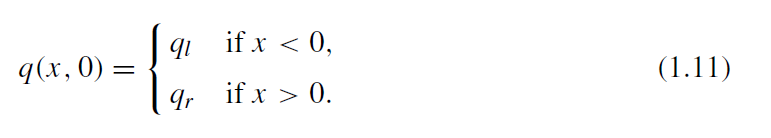

## introudction
Hyperbolic systems of PDE can be used to model a wid variety of phnomena that involve wave motion or the advective transport of substances.

fundamental concepts and an overview of the * primary issues discussed in this book.

The probelms we consier are generally time dependent, so that the solution depdends on time as well as one or more variables. In 1D, a homogeneous first-order ststem of PDE in x and t has the form

$$ \tag{1.1}
q_t(x,t) + Aq_x(x,t) = 0 

$$ [eq 1.1]

in the simplest constant-coefficient linear case. 

Here $q :R × R → R^m$ 

we wish to determine, and A is a constant m ×m real matrix. In order for this problem to be hyperbolic, the matrix must satisfy certain properties discussed below.

in which m =1 and the matrix A reduces to a scalar value. Advective transport refers to a substance being carried along with fluid motion. For example, consider a contaminant being advected downstream with some fluid flowing through
a one-dimensional pipe at constant velocity $\bar{u}$ 

$$ \tag{1.2}
q_t(x,t)+\bar{u}q_x(x,t) = 0
$$

It is easy to verify that this equation admits solutions of the form 

$$ \tag{1.3}
q(x,t) = \tilde{q}(x-\tilde{u}t)
$$

for any function q. The concentration profile specified by q~ by simply porpgate with cosntant speed u~ and unchaged shpae. In this context the quaiton (1.2)

distinct wave can propagate through the material with its shape 
essentially unchanged over long distances, and at a speed c (the 
speed of sound in the material) that is much larger than the 
velocity of material particles. a sound wave propagating in one 
direction (to the right with speed c > 0) can be modeled by the 
equation.

$$ \tag{1.4}
w_t(x,t)+cw_x(x,t)
$$

> one-way wave equation because it models waves propagating in one
particular direction.

where w(x, t) is an appropriate combination of the pressure and particle velocity. suggests that advective transport and wave phenomena can be handled by similar mathematical and numerical techniques.

To model acousticwaves propagating in both directions along a one-dimensional medium,
we must consider the full acoustic equations derived in Chapter 2,

$$\tag{1.5} 
\begin{aligned}
p_t (x, t) + Ku_x (x, t) = 0 \\
u_t (x, t) + (1/ρ)p_x (x, t) = 0
\end{aligned}
$$

$$
\begin{pmatrix}
p \\ u
\end{pmatrix} 
,
A = \begin{pmatrix}
0 & K \\ 1/\rho & 0
\end{pmatrix}
$$

The material is described by the constants K.

To onnect this with the one-way wave equation (1.4) let

$$
w^1(x,t)= p(x,t)+\rho c u (x,t)
$$
where $c=\sqrt{K/\rho}$. then it is easy to check that $w^1(x,t)$  satisfies the euqation

$$
w_t^1+cw_x^1 = 0
$$

so we see taht c can be identified as the speed of sound. on the other hand, the function 

$$
w^2(x,t) = p(,xt)-\rho c u (x,t)
$$

satisfies the equation

$$
w_t^2 -cw_x^2 = 0
$$

This is also a one-way wave equation, but with propagation speed -c

### Conservation Laws

 class of homogeneous hyperoblic equations called conservatiojn laws. The simplest example of a 1D conservation law is the PDE

 $$
 q_t(x,t)+f(q(x,t))_x=0
 $$

 where f(q) is the flux function Rewriting this in the quasilinear form

 $$
 q_t+f'(q)q_x=0
 $$

 hyperbolic if the flux Jacobian matrix f'(q) satisfies the conditions previously given for the matrix A. In fact the linear problem (1.1) is a conservation law with the linear flux function f (q)= Aq. Many physical problems give rise to nonlinear conservation laws in which f (q) is a nonlinear function of q, a vector of conserved quantities.

#### Integral form

 Conservation law

 $$
 \frac{d}{dt}\int_{x_1}^{x_2}q(x,t)dx = f(q(x_1,t))-f(q(x_2,t))
 $$

#### Discontinuous Solutions

### Finite Volume Methods

Discontinuities lead to computational difficulties and the main subject of this book is the accurate approximation of such solutions. Classical finite difference methods, in which derivatives are approximated by finite differences, can be expected to break down near discontinuities in the solution where the differential equation does not hold.

we break the domain into grid cells and approximate the total integral of q over each grid cell or
actually the cell average of q, which is this integral divided by the volume of the cell.

### Riemann Problems

A fundamental tool in the development of finite volume methods is the Riemann problem, which is simply the hyperbolic equation together with special initial data. The data is piecewise constant with a single jump discontinuity at some point, say x = 0,

If $Q_{i−1}$ and $Q_i$ are the cell averages in two neighboring grid cells on a finite volume grid

and consists of a finite set of waves that propagate away from the origin with constant wave speeds.

For linear hyperbolic systems the Riemann problem is easily solved in terms of the eigenvalues and eigenvectors of the matrix A, as developed in Chapter 3.

This simple structure also holds for nonlinear systems of equations and the exact solution (or arbitrarily good approximations) to the Riemann problem can be constructed even for nonlinear systems such as the Euler equations.

### Shock Cpaturing vs Tracking
Since the PDEs continue to hold away from discontinuities, one possible approach is to combine a standard finite difference or finite volume method in smooth regions with some explicit procedure for tracking the location of discontinuities.

* This is the numerical analogue of the mathematical approach in which the PDEs are supplemented by jump conditions across discontinuities. This approach is often called shock tracking or front tracking. 
* Instead we concentrate here on shock-capturing methods where the goal is to capture
discontinuities in the solution automatically, without explicitly tracking them.

Success requires that the method implicitly incorporate the correct jump conditions, reduce smearing to a minimum, and not introduce nonphysical oscillations near the discontinuities

High-resolution finite volume methods based on Riemann solutions often perform well and are much simpler to implement than shock-tracking methods.

### Multidimensional Problems

The Riemann problem is inherently one-dimensional, but is extensively used also in the solution of multidimensional hyperbolic problems. A Riemann problem normal to each edge of the cell can be solved in order to determine the flux across that edge. (iN 2d)

is to use dimensional splitting, a fractional-step approach in which one-dimensional problems along
each coordinate direction are solved in turn.

### Linear Waves and Discountinuous Media

Linear hpyerbolic equations often arise form studying small amplitude waves, where the physical nonlinearities of the ture equations ca nbe safley ignored. 